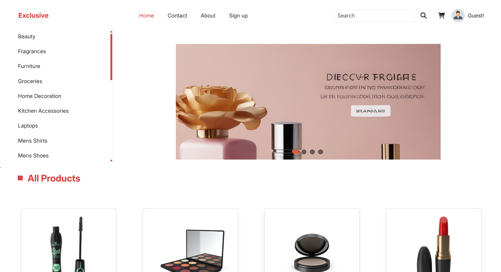
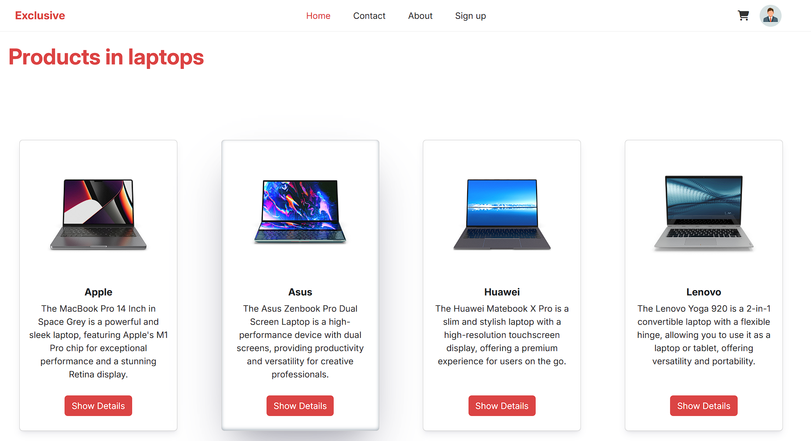
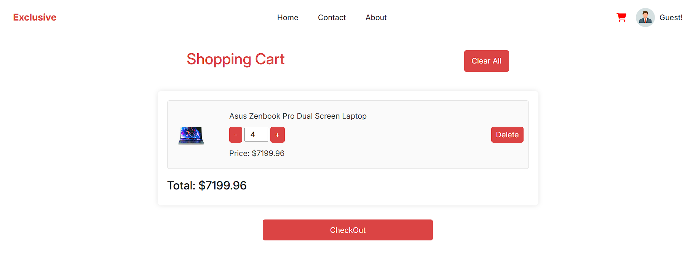
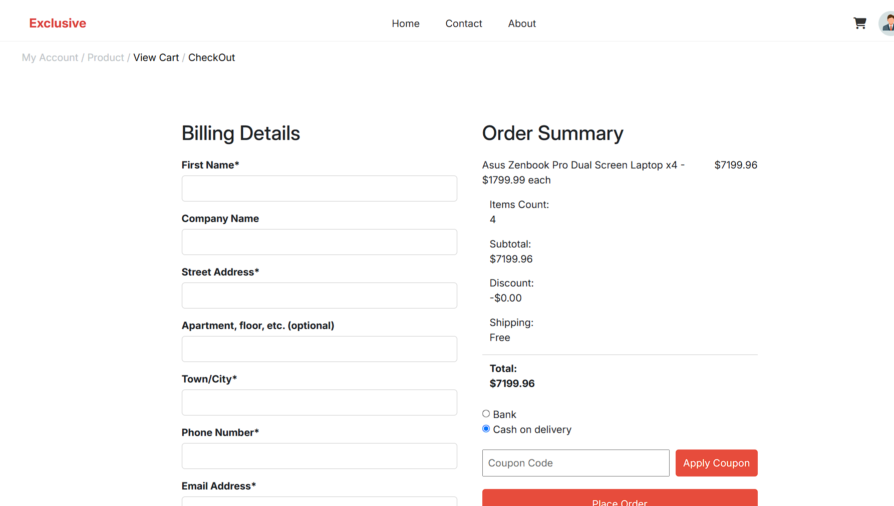
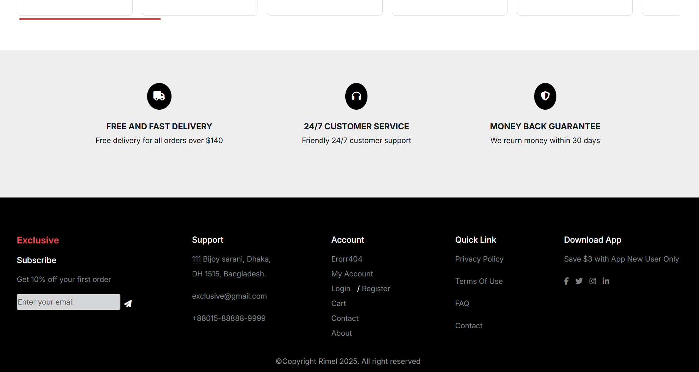
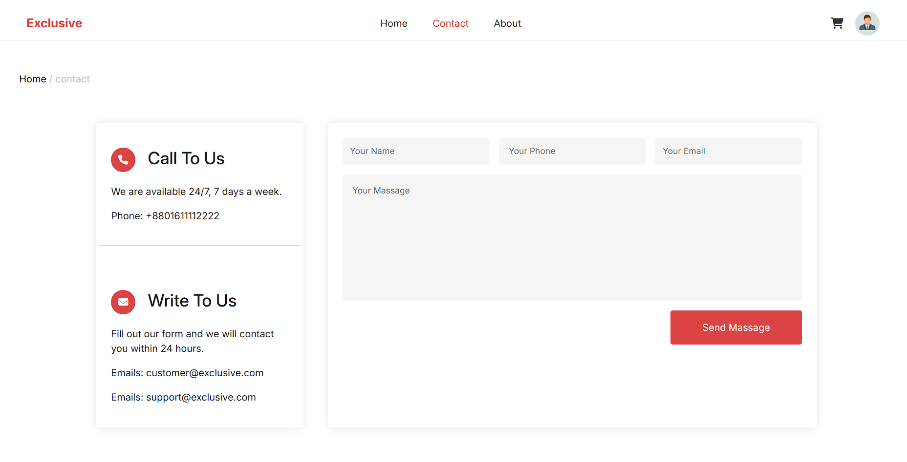
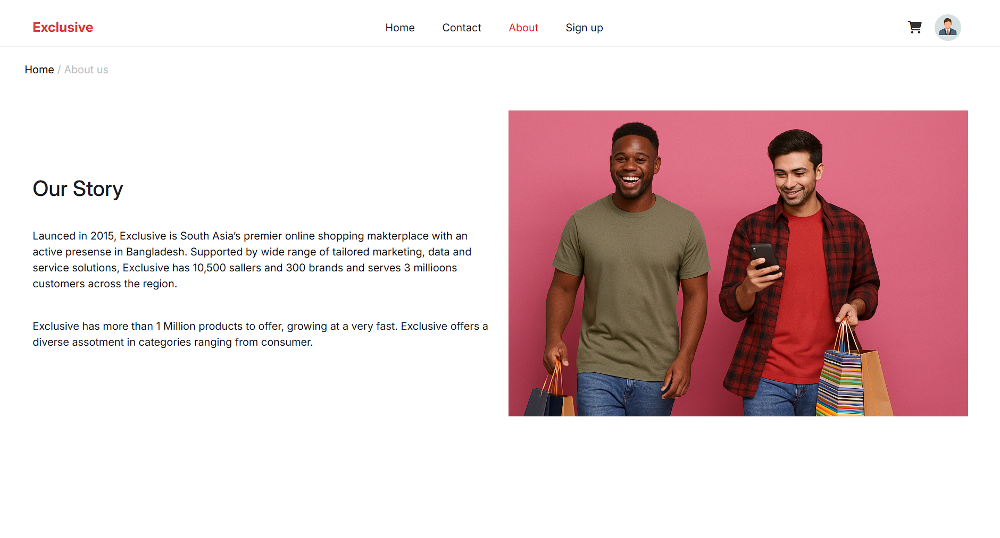
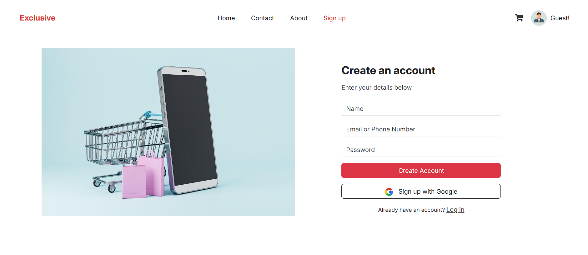
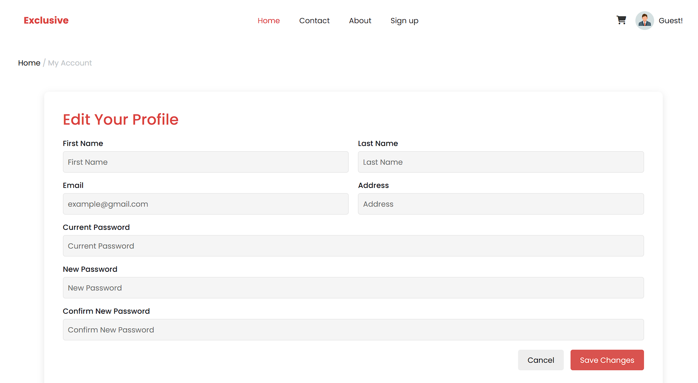

# e-commerce-website

## Project Overview
A modern, responsive e-commerce platform built with [HTML, CSS, JavaScript, boot strap] designed to provide a seamless online shopping experience. This project demonstrates key e-commerce functionalities such as product listings, cart management, and a user-friendly checkout process.

## Key Features
- Product Catalog – Browse products with categories and filters
- Shopping Cart – Add/remove items and adjust quantities
- Responsive Design – Optimized for desktop, tablet, and mobile
- User-Friendly UI – Clean, intuitive interface with smooth animations

## Technologies Used
- HTML, CSS, JAVAScript, Boot Srtap

## Project Images

  
  
  
  
  
  
  
  
  
  

## Open Website
[From here >>](https://taha-m-fawy.github.io/e-commerce-website/index.html)

## Team Members
- [Abdallah Alqiran](https://github.com/Abdallah-Alqiran)
- [Abdelrahman Hafez](https://github.com/Abdelrhman-hafez)
- [Mohamed Abdeldayem](https://github.com/mohamed-abdeldayem)
- [Mahmoud Ali](https://github.com/mohamed-abdeldayem)
- [Taha Fawy](https://github.com/Taha-M-Fawy)
- [Taha Saber](https://github.com/TahaSab3r)
- [Ziad Magdy](https://github.com/ZiadMagdyAlSayed)
